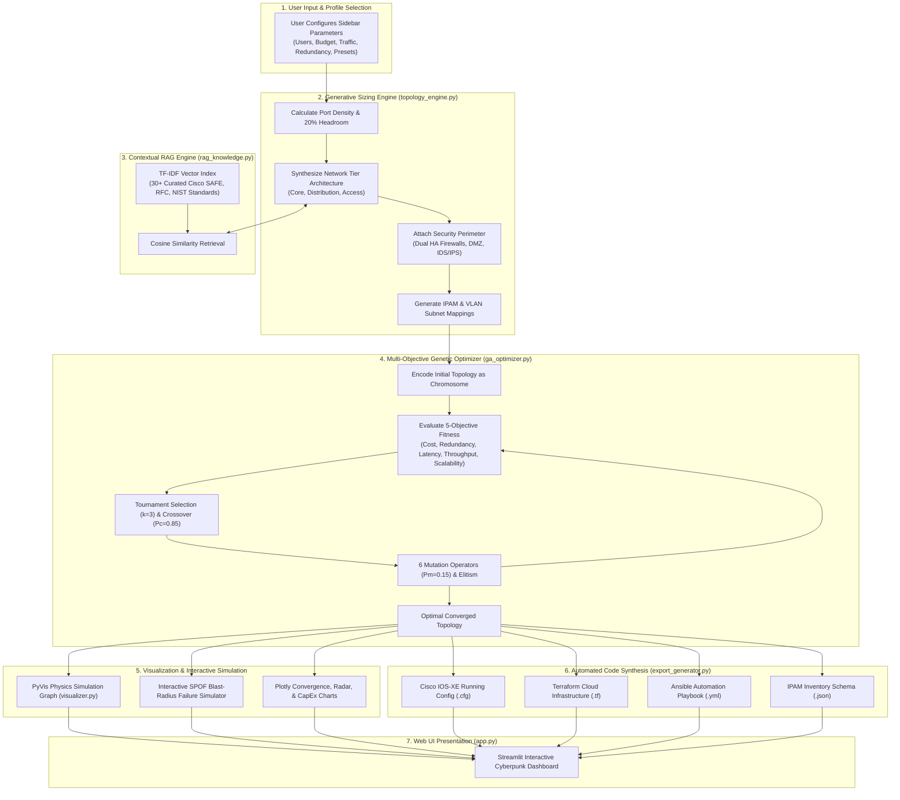

# 🌐 NetGenAI — Complete Project In-Depth Technical Guide

> **NetGenAI**: Autonomous Generative AI-Based Enterprise Network Topology Design, Multi-Objective Genetic Algorithm Optimization, and Infrastructure-as-Code (IaC) Synthesis Platform.

---

## 📑 Table of Contents

1. [Quick Summary (What is this project in simple terms?)](#1-quick-summary-what-is-this-project-in-simple-terms)
2. [The Real-World Problem & Why We Need NetGenAI](#2-the-real-world-problem--why-we-need-netgenai)
3. [Core Concepts Explained Simply](#3-core-concepts-explained-simply)
4. [High-Level Architecture & End-to-End Workflow](#4-high-level-architecture--end-to-end-workflow)
5. [The 9 Network Topologies Explained in Plain English](#5-the-9-network-topologies-explained-in-plain-english)
6. [Complete Codebase Deep Dive (File-by-File Breakdown)](#6-complete-codebase-deep-dive-file-by-file-breakdown)
   - [6.1 `network_models.py` — Hardware Catalog, Link Specs, & Dataclasses](#61-network_modelspy--hardware-catalog-link-specs--dataclasses)
   - [6.2 `topology_engine.py` — Architecture Generator & Failure Simulator](#62-topology_enginepy--architecture-generator--failure-simulator)
   - [6.3 `ga_optimizer.py` — Multi-Objective Genetic Algorithm Engine](#63-ga_optimizerpy--multi-objective-genetic-algorithm-engine)
   - [6.4 `rag_knowledge.py` — Offline Vector RAG & Industry Standards](#64-rag_knowledgepy--offline-vector-rag--industry-standards)
   - [6.5 `visualizer.py` — Interactive Physics Graph & Plotly Analytics](#65-visualizerpy--interactive-physics-graph--plotly-analytics)
   - [6.6 `export_generator.py` — Cisco IOS-XE, Terraform, Ansible, & IPAM Exporters](#66-export_generatorpy--cisco-ios-xe-terraform-ansible--ipam-exporters)
   - [6.7 `app.py` — Streamlit Cyberpunk UI & Reactive State](#67-apppy--streamlit-cyberpunk-ui--reactive-state)
7. [Mathematical Formulas & Algorithms Explained Step-by-Step](#7-mathematical-formulas--algorithms-explained-step-by-step)
   - [7.1 "Five Nines" (99.999%) Availability Formula](#71-five-nines-99999-availability-formula)
   - [7.2 Oversubscription Ratio Calculation](#72-oversubscription-ratio-calculation)
   - [7.3 Genetic Algorithm Multi-Objective Fitness Function](#73-genetic-algorithm-multi-objective-fitness-function)
   - [7.4 In-Memory TF-IDF Vector Search & Cosine Similarity](#74-in-memory-tf-idf-vector-search--cosine-similarity)
   - [7.5 Graph Cut-Vertex & Blast-Radius Failure Simulation](#75-graph-cut-vertex--blast-radius-failure-simulation)
8. [Application User Interface (UI) Walkthrough](#8-application-user-interface-ui-walkthrough)
9. [How to Run and Test the Project](#9-how-to-run-and-test-the-project)
10. [Top Viva & Technical Interview Questions (With Clear Answers)](#10-top-viva--technical-interview-questions-with-clear-answers)

---

## 1. Quick Summary (What is this project in simple terms?)

Imagine a company wants to set up an IT network for 1,000 employees. Normally, a senior network architect takes weeks to decide:
- How many switches and routers to buy.
- Which specific models (Cisco, Juniper, Arista) fit the budget.
- How to connect them so that if one wire or switch breaks, the office doesn't lose internet.
- How to set up firewalls, DMZ, and VLANs for security regulations (like PCI-DSS or HIPAA).
- How to write hundreds of lines of router commands.

**NetGenAI automates this entire process in under 5 seconds:**
1. **You enter requirements**: Number of users, budget, traffic level, security needs, and regulatory compliance.
2. **Generative Sizing Engine**: Automatically calculates the exact number of switches, core routers, redundant uplinks, and security zones needed.
3. **RAG Knowledge Base**: Scans 30+ networking industry standards (Cisco SAFE, RFC 7938, NIST Zero-Trust) to validate design best practices.
4. **Genetic Algorithm Optimizer**: Runs an evolutionary AI algorithm across 50 generations to balance 5 competing goals: **lowest cost, highest redundancy, lowest latency, highest throughput, and future scalability**.
5. **Interactive Failure Simulator**: Lets you click any router/switch to "kill" it and immediately observe the blast radius and surviving connectivity percentage.
6. **Infrastructure as Code (IaC) Synthesis**: Generates ready-to-deploy Cisco switch commands, Terraform scripts for cloud VPCs, and Ansible automation playbooks.

---

## 2. The Real-World Problem & Why We Need NetGenAI

| The Challenge in Industry | What Usually Goes Wrong | How NetGenAI Solves It |
|---|---|---|
| **Human Estimation Errors** | Engineers guess switch port capacity or oversubscription ratios, leading to bottlenecks during peak hours. | Mathematically calculates port density with automated 20% growth headroom. |
| **Single Point of Failure (SPOF)** | A single broken core link brings down the entire corporate building. | Enforces dual-homed redundant uplinks and validates failover using graph theory. |
| **Budget Mismanagement** | Buying overly expensive 100G switches for a small branch, or cheap 1G switches that choke a data center. | Automatic tier selection (Budget vs Standard vs Enterprise) based on actual budget constraints. |
| **Security Compliance Violations** | Forgetting to isolate the payment gateway (PCI-DSS) or health data (HIPAA) in separate DMZ/VLAN subnets. | Automated placement of dual HA Firewalls, IDS/IPS, and isolated DMZ switches based on selected compliance frameworks. |
| **Slow Manual Configuration** | Typing CLI commands switch by switch takes days and causes human syntax errors. | Generates complete Cisco IOS-XE, Terraform HCL, and Ansible automation code in 1 click. |

---

## 3. Core Concepts Explained Simply

Before diving into the code, here are the core concepts explained in simple, intuitive language:

### 🔹 1. Network Topology
A **topology** is the structural map of how computers, switches, routers, and firewalls are connected together.
- **Nodes** = Physical devices (Switches, Routers, Firewalls, Servers).
- **Edges / Links** = Physical cables connecting them (Cat6a copper, OM4 multimode fiber, OS2 single-mode fiber).

### 🔹 2. Generative Architectural Sizing
Instead of having a static diagram, the system calculates device counts dynamically based on math:
- If you have 500 users and each access switch has 48 ports (with 8 reserved for uplinks/headroom = 40 user ports), the system calculates:
  $$\text{Access Switches} = \left\lceil \frac{500 \times 1.20}{40} \right\rceil = 15 \text{ switches}$$
- It then sizes the distribution layer and core layer to match this bandwidth demand.

### 🔹 3. Genetic Algorithm (Evolutionary AI)
- **Concept**: Just like biological evolution where the fittest organisms survive, a Genetic Algorithm (GA) creates a population of multiple network designs (called *chromosomes*).
- It tests each design against 5 goals: Cost, Redundancy, Latency, Throughput, and Scalability.
- Over 50 generations, it combines the best parts of good designs (Crossover) and introduces small random improvements (Mutation) to find the mathematically optimal network.

### 🔹 4. RAG (Retrieval-Augmented Generation)
- **Analogy**: Imagine taking an open-book exam instead of memorizing everything.
- NetGenAI has an offline knowledge base containing 30+ official networking standards (Cisco SAFE, Arista RFC 7938, NIST Zero Trust).
- Using **TF-IDF Vector Search**, it searches this knowledge base for the exact rules relevant to your specific network size and displays recommendations alongside the design.

### 🔹 5. Blast Radius & Cut-Vertex (Failure Simulation)
- In graph theory, a **Cut-Vertex** (or Articulation Point) is a node whose removal splits the network into two or more disconnected pieces.
- If a core switch is a cut-vertex, it represents a catastrophic **Single Point of Failure**.
- NetGenAI's simulator removes any chosen device and calculates how many endpoints lose connection (the **Blast Radius**).

---

## 4. High-Level Architecture & End-to-End Workflow

The diagram below illustrates the complete lifecycle of a network design inside NetGenAI:



---

## 5. The 9 Network Topologies Explained in Plain English

NetGenAI can synthesize 9 standard industry topologies. Here is how and when each is used:

### 1. Cisco 3-Tier Hierarchical (Core, Distribution, Access)
- **Structure**:
  - **Core Layer**: Super high-speed backbone (40G/100G fiber), no packet filtering, its only job is ultra-fast routing.
  - **Distribution Layer**: Aggregates access switches, routes between VLANs, applies Access Control Lists (ACLs) and QoS.
  - **Access Layer**: Connects end-user computers, IP phones, and WiFi APs with PoE.
- **Best For**: University campuses, corporate headquarters, hospitals (500–5,000+ users).

### 2. Spine-Leaf (Clos) Architecture
- **Structure**: Every **Leaf switch** connects to every **Spine switch** in a grid. Leaves do not connect to leaves; spines do not connect to spines.
- **Why it is special**: In modern data centers, servers talk to other servers constantly (**East-West traffic**). In Spine-Leaf, every server is exactly **2 hops away** from any other server with zero bottleneck.
- **Best For**: Cloud data centers, AI/ML clusters, containerized microservices (AWS/Azure style).

### 3. Collapsed Core
- **Structure**: The Core layer and Distribution layer are merged into a single pair of redundant Layer-3 switches.
- **Why it is used**: Slashes hardware costs and power consumption while still providing gateway redundancy (HSRP/VRRP).
- **Best For**: Medium enterprises (50–500 users) that cannot justify the cost of dedicated standalone core routers.

### 4. Fat-Tree ($k$-ary Clos)
- **Structure**: A specialized data center topology built using identical $k$-port commodity switches arranged in pods.
- **Advantage**: Guarantees **Full Bisectional Bandwidth** (no oversubscription at all) using affordable, identical hardware.
- **Best For**: High-Performance Computing (HPC) and supercomputing research labs.

### 5. Full Mesh
- **Structure**: Every single device is connected to every other device via dedicated cables. Total links formula:
  $$\text{Links} = \frac{n(n-1)}{2}$$
- **Advantage**: Maximum possible redundancy. If 3 cables break, traffic simply takes another route.
- **Disadvantage**: Extremely expensive for high node counts ($n=10 \implies 45$ cables; $n=20 \implies 190$ cables).
- **Best For**: Mission-critical banking backbones, military defense networks.

### 6. Partial Mesh
- **Structure**: Critical core nodes have multiple redundant interconnections, while edge switches have dual uplinks.
- **Advantage**: Provides 90% of the reliability of a Full Mesh at a fraction of the cabling cost.
- **Best For**: Wide Area Networks (WANs) connecting distributed branch offices across cities.

### 7. Redundant Ring
- **Structure**: Devices are wired in a closed circular loop with a counter-rotating backup loop.
- **Advantage**: If a fiber cable is severed anywhere in the ring, traffic automatically reverses direction in under 50 milliseconds using protocols like ERPS (Ethernet Ring Protection Switching).
- **Best For**: Metro rail systems, smart cities, oil & gas pipelines, factory industrial automation.

### 8. Star Topology
- **Structure**: All endpoint devices connect directly to a single central switch.
- **Advantage**: Cheapest and simplest design to install and troubleshoot.
- **Disadvantage**: If the central switch dies, the entire office loses connectivity.
- **Best For**: Small retail stores, branch offices (10–50 users).

### 9. Hybrid Topology
- **Structure**: Combines multiple topologies (e.g., a Mesh Core backbone + 3-Tier Campus Distribution + Spine-Leaf Data Center).
- **Best For**: Massive global enterprises with diverse networking needs.

---

## 6. Complete Codebase Deep Dive (File-by-File Breakdown)

Here is a thorough analysis of every single file in the repository, explaining its purpose, inner methods, and technical logic.

### 6.1 `network_models.py` — Hardware Catalog, Link Specs, & Dataclasses

This file defines the physical reality of the network. It does not use fake or placeholder numbers; it contains real enterprise hardware models, prices, port densities, and reliability figures.

#### Key Enums Defined:
- `DeviceType`: `CORE_ROUTER`, `DISTRIBUTION_ROUTER`, `L3_SWITCH`, `L2_SWITCH`, `FIREWALL`, `LOAD_BALANCER`, `IDS_IPS`, `DMZ_SWITCH`, etc.
- `NetworkTier`: `CORE`, `DISTRIBUTION`, `ACCESS`, `DMZ`, `MANAGEMENT`, `WAN_EDGE`, `DATA_CENTER`.
- `LinkMedia`: Cat6a copper (1G), OM4 Multimode Fiber (10G/25G), OS2 Singlemode Fiber (40G/100G/400G).
- `ComplianceFramework`: `PCI_DSS`, `HIPAA`, `SOC2`, `ISO_27001`, `NIST`.

#### Real-World Hardware Database (`DEVICE_CATALOG`):
| Device Role | Hardware Model | Port Configuration | Unit Cost (USD) | MTBF (Hours) | Power (W) |
|---|---|---|---|---|---|
| **Core Router** | Cisco Catalyst 9500 | 48x 25G SFP28 + 4x 100G QSFP28 | \$45,000 | 450,000 hrs (~51 yrs) | 650W |
| **Data Center Core** | Cisco Nexus 9300 | 48x 100G + 8x 400G | \$65,000 | 500,000 hrs | 850W |
| **Distribution** | Cisco Catalyst 9300 | 48x 1G PoE+ + 4x 10G SFP+ Uplinks | \$12,500 | 380,000 hrs | 350W |
| **Access Switch** | Cisco Catalyst 1000 | 48x 1G Ethernet + 4x 1G SFP | \$2,800 | 320,000 hrs | 180W |
| **Budget Access** | EdgeCore ECS4120 | 28x 1G Ethernet + 4x 10G SFP+ | \$1,200 | 250,000 hrs | 120W |
| **Firewall (NGFW)** | Palo Alto PA-3220 | 12x 1G + 4x 10G (5 Gbps Threat Prevention) | \$28,000 | 390,000 hrs | 240W |
| **Load Balancer** | F5 BIG-IP i4800 | 8x 10G SFP+ (20 Gbps Throughput) | \$32,000 | 410,000 hrs | 280W |

#### Mathematical Utility Functions:
- `calculate_availability(mtbf_hours, mttr_hours=4.0)`: Calculates exact fractional uptime ($A = \frac{\text{MTBF}}{\text{MTBF} + 4}$).
- `availability_to_nines(availability)`: Maps decimal values to strings like `"99.999% (Five Nines)"`.
- `calculate_power_cost(watts, rate_per_kwh=0.14)`: Computes annual electricity cost in USD:
  $$\text{Annual Cost} = \frac{\text{Watts} \times 24 \times 365}{1000} \times 0.14$$

---

### 6.2 `topology_engine.py` — Architecture Generator & Failure Simulator

This module is the core structural engine. It uses Python's `networkx` library to build and manipulate network graph models.

#### Key Internal Workflow of `TopologyEngine.generate()`:
1. **User Port Sizing**:
   Reads `requirements.num_users`. Calculates required access switches with a **20% growth margin**.
2. **Topology Synthesis**:
   Depending on `requirements.preferred_topology`, it invokes specific builders:
   - `_build_three_tier()`: Builds redundant Core routers, dual Distribution switches, and multi-access pods with cross-chassis LAG (LACP) uplinks.
   - `_build_spine_leaf()`: Builds Spine nodes and Leaf switches where every leaf connects to every spine with Equal-Cost Multi-Pathing (ECMP).
   - `_build_collapsed_core()`, `_build_fat_tree()`, `_build_mesh()`, etc.
3. **Security Perimeter Attachment (`_add_security_perimeter()`)**:
   - If Firewall is requested: Creates an Active/Standby pair of Palo Alto firewalls between the Internet Gateway and Core.
   - If DMZ is requested: Provisions isolated DMZ switches hosting Public Web and Mail servers outside the private LAN.
   - Places inline IDS/IPS sensors to inspect transit packets.
4. **VLAN & IPAM Assignment (`_assign_vlans_and_ipam()`)**:
   Automatically allocates RFC 1918 subnets:
   - Management: `10.0.1.0/24` (VLAN 10)
   - Database / Servers: `10.0.2.0/24` (VLAN 20)
   - Corporate LAN: `10.0.3.0/24` (VLAN 30)
   - Voice over IP (VoIP): `10.0.4.0/24` (VLAN 40)
   - DMZ Public: `172.16.1.0/24` (VLAN 50)
5. **Interactive Failure Simulator (`simulate_failure(target_node_id)`)**:
   - Clones the current `networkx.Graph`.
   - Deletes `target_node_id` and all incident edges.
   - Checks `nx.number_connected_components(G)`.
   - Computes:
     - Direct links severed.
     - Isolated network subnets.
     - Surviving connectivity percentage across all remaining nodes.

---

### 6.3 `ga_optimizer.py` — Multi-Objective Genetic Algorithm Engine

When an initial network is synthesized, it may be sub-optimal (e.g., using hardware that is too expensive or missing a backup link). The **Genetic Algorithm (GA)** fine-tunes the network through artificial evolution.

#### Chromosome Representation:
A network design is encoded into a `Chromosome` object containing:
- `adjacency`: List of tuples `(source, target, bandwidth_gbps)`.
- `device_tiers`: Dictionary mapping each device to a tier index (`0`: Budget, `1`: Standard, `2`: Enterprise).
- `link_redundancy`: Dictionary of boolean flags marking whether an uplink has an active/standby partner.

#### The 5 Fitness Objectives:
1. **Cost Score ($S_{\text{cost}}$)**: Normalized CapEx vs. user budget.
2. **Redundancy Score ($S_{\text{red}}$)**: Biconnected components, presence of dual gateways, and link redundancy percentage.
3. **Latency Score ($S_{\text{lat}}$)**: Average shortest hop count from Access layer to Internet Gateway.
4. **Throughput Score ($S_{\text{thr}}$)**: Core bisectional bandwidth vs. peak traffic load.
5. **Scalability Score ($S_{\text{scale}}$)**: Free port headroom for future device onboarding.

#### Evolutionary Operators:
- **Tournament Selection ($k=3$)**: Picks 3 random chromosomes from the population; the one with the highest total fitness wins the right to reproduce.
- **Single-Point Crossover ($P_c = 0.85$)**: Swaps link sets and hardware tier genes between two parent topologies.
- **6 Domain-Specific Mutations ($P_m = 0.15$)**:
  1. `mutate_add_link`: Finds a single point of failure and adds a redundant bypass link.
  2. `mutate_prune_link`: Removes redundant links that form useless loops to save CapEx.
  3. `mutate_upgrade_device`: Upgrades an overloaded switch to a higher hardware tier.
  4. `mutate_downgrade_device`: Downgrades an underutilized switch to save cost.
  5. `mutate_scale_bandwidth`: Upgrades link media (e.g., 10G $\to$ 25G or 40G $\to$ 100G).
  6. `mutate_toggle_redundancy`: Activates HSRP/VRRP failover pairs on distribution uplinks.
- **Elitism ($E = 2$)**: Preserves the top 2 best-performing chromosomes across generations so the algorithm never regresses.

---

### 6.4 `rag_knowledge.py` — Offline Vector RAG & Industry Standards

Rather than querying slow, external cloud APIs, NetGenAI includes an in-memory, deterministic Vector Retrieval-Augmented Generation (RAG) system.

#### Knowledge Corpus:
Contains 30+ structured technical standards categorized by:
- **Architecture**: Cisco SAFE campus guide, 3-Tier distribution rules, Clos Spine-Leaf scaling.
- **Data Center**: Arista RFC 7938 (BGP in data centers), VXLAN/EVPN overlays.
- **Security & Compliance**: NIST SP 800-207 Zero-Trust Architecture, PCI-DSS 4.0 requirement 1.3 (firewall DMZ isolation), HIPAA physical security safeguards.
- **Protocols**: OSPF multi-area design, BGP confederations, HSRPv2 vs VRRPv3.

#### In-Memory TF-IDF Vector Search Engine:
1. Builds a term vocabulary from all curated knowledge documents.
2. Computes the **Term Frequency (TF)** and **Inverse Document Frequency (IDF)** for all words.
3. When a user queries (e.g., *"How should I size oversubscription for spine-leaf?"*), the query is transformed into a TF-IDF vector.
4. Calculates the **Cosine Similarity** between the query vector and every document vector in microseconds.
5. Returns the top $K$ most relevant design rules directly into the UI.

---

### 6.5 `visualizer.py` — Interactive Physics Graph & Plotly Analytics

Handles user visualization by compiling graph topologies into interactive browser-rendered components.

#### 1. PyVis Dynamic Physics Graph (`build_pyvis_network_html()`):
- Converts `networkx.Graph` into Vis.js HTML/JavaScript.
- Uses the **Barnes-Hut** physics simulation model:
  - Nodes have mass and electrostatic repulsion (preventing overlapping).
  - Links act like physical springs (pulling connected switches into natural geometric clusters).
- Nodes are color-coded by tier:
  - 🔴 **Core**: `#ef4444`
  - 🟣 **Data Center / Spines**: `#7b2ff7`
  - 🔵 **Distribution**: `#00d4ff`
  - 🟢 **Access**: `#10b981`
  - 🟡 **Security / DMZ**: `#f59e0b`
- Rich hover tooltips show exact hardware model, IP address, port count, MTBF, and connected links.

#### 2. Plotly Charts:
- `build_fitness_chart()`: Plots Best, Average, and Worst fitness convergence across 50 generations.
- `build_radar_chart()`: 5-axis spider radar comparing initial vs. GA-optimized metrics.
- `build_cost_donut_chart()`: Interactive CapEx breakdown by network tier (Core vs Access vs Security vs Cabling).

---

### 6.6 `export_generator.py` — Cisco IOS-XE, Terraform, Ansible, & IPAM Exporters

This module converts the abstract mathematical graph into ready-to-run code for network engineers and DevOps pipelines:

1. **Cisco IOS-XE Script (`.cfg`)**:
   - Generates switch configuration with `spanning-tree mode rapid-pvst`.
   - Defines VLAN databases (`vlan 10`, `vlan 20`, `name Corporate_Data`).
   - Configures trunk ports with 802.1Q encapsulation and allowed VLAN lists.
   - Configures Loopback0 management interfaces and OSPF router advertisements.
2. **Terraform Infrastructure as Code (`main.tf`)**:
   - Emits HashiCorp HCL code provisioning an AWS VPC (`cidr_block = "10.0.0.0/16"`).
   - Provisions public and private subnets mapping to each designed network tier.
   - Creates Internet Gateways and route table associations.
3. **Ansible Automation Playbook (`playbook.yml`)**:
   - Writes production-ready Ansible plays using the `cisco.ios.ios_config` collection.
   - Automates batch configuration across all switches simultaneously with zero manual CLI entry.
4. **IPAM Inventory (`network_ipam.json`)**:
   - Full JSON export containing node IDs, hardware models, IP addresses, subnets, gateways, and link bandwidths for integration into NetBox or SolarWinds.

---

### 6.7 `app.py` — Streamlit Cyberpunk UI & Reactive State

The main web application orchestrating all components:
- **Theme**: Dark cyberpunk aesthetic with glassmorphic cards, neon status pills, and JetBrains Mono code typography.
- **Session State Management**: Persists `st.session_state.current_graph`, `metrics`, `ga_summary`, and `sim_result` across user interactions.
- **Sidebar Controls**:
  - Enterprise Profile Presets: Quick-load financial, healthcare, or SaaS data center profiles.
  - Granular Sliders: Users, budget, departments, traffic load, fault tolerance, and security features.
  - Genetic Algorithm Tuners: Population size, max generations, and 5 fitness objective weights ($w_{\text{cost}}, w_{\text{red}}, \dots$).

---

## 7. Mathematical Formulas & Algorithms Explained Step-by-Step

### 7.1 "Five Nines" (99.999%) Availability Formula

High Availability in computer networks is measured in terms of uptime:

$$A = \frac{\text{MTBF}}{\text{MTBF} + \text{MTTR}}$$

Where:
- $\text{MTBF}$ = Mean Time Between Failures (hours device runs before failing).
- $\text{MTTR}$ = Mean Time To Repair (hours to replace or reboot, standard = 4 hours).

#### Series Availability (No Redundancy):
If two switches are in series (traffic must pass through both):
$$A_{\text{total}} = A_1 \times A_2$$
*(Uptime drops because if either fails, traffic stops)*.

#### Parallel Availability (Active/Standby Pair):
If two core switches are deployed as a redundant HSRP/VRRP pair:
$$A_{\text{total}} = 1 - (1 - A_1)(1 - A_2)$$
*(Even if Switch 1 has 99.9% uptime, the pair achieves **99.999%** uptime, meaning less than **5 minutes and 15 seconds** of downtime per year)*.

---

### 7.2 Oversubscription Ratio Calculation

Oversubscription measures how much bandwidth is shared among users:

$$\text{Oversubscription Ratio} = \frac{\sum \text{Access Downlink Capacity to Endpoints}}{\sum \text{Distribution Uplink Capacity to Core}}$$

**Example Calculation**:
- An access switch connects 40 employee computers at $1\text{ Gbps}$ each $\implies \text{Downlink} = 40\text{ Gbps}$.
- The switch has two $10\text{ Gbps}$ uplinks to distribution $\implies \text{Uplink} = 20\text{ Gbps}$.
- $\text{Oversubscription Ratio} = \frac{40}{20} = 2:1$ *(Excellent, non-blocking campus performance)*.

---

### 7.3 Genetic Algorithm Multi-Objective Fitness Function

The fitness function evaluates how well a network chromosome satisfies 5 competing constraints:

$$\text{Total Fitness} = w_{\text{cost}} \cdot S_{\text{cost}} + w_{\text{red}} \cdot S_{\text{red}} + w_{\text{lat}} \cdot S_{\text{lat}} + w_{\text{thr}} \cdot S_{\text{thr}} + w_{\text{scale}} \cdot S_{\text{scale}}$$

Subject to the constraint:
$$w_{\text{cost}} + w_{\text{red}} + w_{\text{lat}} + w_{\text{thr}} + w_{\text{scale}} = 1.0$$

Where:
- $S_{\text{cost}} = \max\left(0, 1 - \frac{\text{Total CapEx}}{\text{Budget}}\right)$
- $S_{\text{red}} = \frac{\text{Redundant Links Count}}{\text{Total Links Count}} \times \text{Biconnectivity Factor}$
- $S_{\text{lat}} = \frac{1}{\text{Average Shortest Path Hops}}$
- $S_{\text{thr}} = \min\left(1.0, \frac{\text{Core Capacity (Gbps)}}{\text{Peak Required Bandwidth (Gbps)}}\right)$
- $S_{\text{scale}} = \frac{\text{Available Free Ports}}{\text{Total Hardware Ports}}$

---

### 7.4 In-Memory TF-IDF Vector Search & Cosine Similarity

To find relevant networking rules without external AI calls:

1. **Term Frequency ($\text{TF}$)**:
   $$\text{TF}(t, d) = \frac{\text{Count of term } t \text{ in document } d}{\text{Total terms in } d}$$
2. **Inverse Document Frequency ($\text{IDF}$)**:
   $$\text{IDF}(t) = \log\left(\frac{1 + N}{1 + \text{count of docs containing } t}\right) + 1$$
3. **Cosine Similarity**:
   $$\text{Similarity}(\mathbf{q}, \mathbf{d}) = \frac{\mathbf{q} \cdot \mathbf{d}}{\|\mathbf{q}\| \|\mathbf{d}\|} = \frac{\sum_{i=1}^{n} q_i d_i}{\sqrt{\sum_{i=1}^{n} q_i^2} \sqrt{\sum_{i=1}^{n} d_i^2}}$$

---

### 7.5 Graph Cut-Vertex & Blast-Radius Failure Simulation

When a device $v$ is targeted for failure:
1. The engine constructs a subgraph $G' = G \setminus \{v\}$.
2. It runs **Tarjan's Depth-First Search (DFS)** algorithm to identify articulation points.
3. If the number of connected components increases ($|C(G')| > |C(G)|$), node $v$ was a **Cut-Vertex**.
4. The blast radius percentage is computed as:
   $$\text{Surviving Connectivity} = \left(\frac{\text{Size of Largest Connected Component}}{|V| - 1}\right) \times 100\%$$

---

## 8. Application User Interface (UI) Walkthrough

The Streamlit interface is divided into 5 distinct operational tabs:

```
┌─────────────────────────────────────────────────────────────────────────────┐
│  🌐 NetGenAI — Autonomous Enterprise Network Topology Designer              │
│  ● LLM Synthesis Active   ● RAG Vector Index: 30 RFCs   ● GA Pareto Engine   │
├─────────────────────────────────────────────────────────────────────────────┤
│  [ CapEx: $142,500 ] [ OpEx: $18,200 ] [ Uptime: 99.999% ] [ Resilience: 94 ]│
├─────────────────────────────────────────────────────────────────────────────┤
│ [Tab 1: Graph] [Tab 2: AI & RAG] [Tab 3: GA Evolution] [Tab 4: BOM] [Tab 5: IaC] │
└─────────────────────────────────────────────────────────────────────────────┘
```

1. **Tab 1: Interactive Topology Graph & Failure Simulator**:
   - Left: Interactive PyVis physics graph. Drag nodes, zoom in, and hover over devices to see model numbers and IP addresses.
   - Right: Failure simulation dropdown. Select any switch or router, click **Simulate Device Failure**, and inspect direct severed links, isolated segments, and surviving connectivity percentage.
2. **Tab 2: Generative AI Reasoning & RAG Insights**:
   - Left: Synthetic Chain-of-Thought reasoning explaining every sizing decision step-by-step.
   - Right: RAG knowledge search bar. Type natural queries like *"oversubscription"* or *"firewall DMZ"* to view matching RFC/NIST standards.
3. **Tab 3: Genetic Algorithm Evolution**:
   - Visualizes fitness convergence curves over 50 generations.
   - 5-axis Radar chart comparing the initial design vs. the GA-optimized design.
   - Breakdown of all mutation operators triggered during evolution.
4. **Tab 4: Financials, BOM, & Compliance**:
   - CapEx donut chart showing investment by network tier.
   - Complete itemized Bill of Materials (BOM) with a one-click CSV download button.
   - Regulatory compliance report for PCI-DSS 4.0, HIPAA, and SOC 2.
   - Subnet & VLAN IPAM table (VLAN IDs, subnets, and gateways).
5. **Tab 5: Infrastructure as Code (IaC) & Exports**:
   - Radio buttons to toggle between **Cisco IOS-XE (.cfg)**, **Terraform (.tf)**, **Ansible (.yml)**, and **IPAM JSON**.
   - Code syntax highlighting with dedicated download buttons for each file.

---

## 9. How to Run and Test the Project

### System Requirements:
- Python 3.10, 3.11, or 3.12
- Operating System: Windows, macOS, or Linux

### Step 1: Clone or Navigate to the Project Folder
```bash
cd c:\Users\parth\OneDrive\Documents\CN
```

### Step 2: Set Up Virtual Environment (Optional but Recommended)
```bash
python -m venv venv

# On Windows:
.\venv\Scripts\activate

# On Linux/macOS:
source venv/bin/activate
```

### Step 3: Install Required Packages
```bash
pip install -r requirements.txt
```
*(Packages installed: `streamlit`, `networkx`, `pyvis`, `plotly`, `pandas`, `scikit-learn`)*

### Step 4: Run the Automated Test Suite
```bash
python test_suite.py
```
**Expected Output**:
```
.....
----------------------------------------------------------------------
Ran 5 tests in 0.175s

OK
```
*(Verifies all 9 topologies, RAG retrieval, Genetic Algorithm optimization, failure simulation, and exporter functions)*.

### Step 5: Start the Web Dashboard
```bash
streamlit run app.py
```
Open your browser and navigate to **`http://localhost:8501`**.

---

## 10. Top Viva & Technical Interview Questions (With Clear Answers)

### Q1: What is the fundamental difference between Cisco 3-Tier and Spine-Leaf (Clos) architecture?
**Answer**:
- **Cisco 3-Tier (Core-Distribution-Access)** is designed for **Campus Networks** where traffic flows primarily **North-South** (from user desktops out to the internet or corporate servers). It uses Spanning Tree Protocol (STP) to block loops on redundant links.
- **Spine-Leaf** is designed for modern **Data Centers** where traffic flows primarily **East-West** (server-to-server or microservice-to-microservice). Every leaf switch is connected to every spine switch. It replaces STP with Layer-3 routing (BGP/ECMP), ensuring deterministic 2-hop latency with zero blocked links.

### Q2: Why use a Genetic Algorithm instead of a simple Greedy Algorithm or Linear Programming?
**Answer**:
Network topology design is a multi-constrained, multi-objective **NP-hard problem**. 
- A Greedy algorithm makes the best choice at each individual step and gets trapped in **local optima** (e.g., choosing the cheapest switch everywhere, resulting in a network with zero redundancy and massive latency).
- Linear programming requires strictly linear formulas, which cannot easily capture graph-theoretical properties like biconnectivity, cut-vertices, and dynamic routing failover.
- Genetic Algorithms maintain a diverse population of solutions and use crossover and mutation to explore non-linear tradeoffs, converging on a **Pareto-optimal** balance of cost, redundancy, latency, and throughput.

### Q3: Why does NetGenAI use TF-IDF vectorization for RAG instead of heavy LLM embeddings (like OpenAI text-embedding-3 or BERT)?
**Answer**:
1. **Zero External Latency & 100% Offline**: It runs entirely in-memory with zero internet connection, zero API keys, and zero cloud subscription costs.
2. **Deterministic & Explainable**: TF-IDF scoring is transparent; you can mathematically inspect why a specific standard was matched based on term frequency and cosine angle.
3. **Ultra-Lightweight**: Calculates similarity across 30+ networking documents in under 2 milliseconds on standard consumer CPUs without requiring a dedicated GPU.

### Q4: How does the Failure Simulator detect network breakage under the hood?
**Answer**:
It uses **Graph Connected Components** from graph theory:
1. When a user fails a device, that node and its incident edges are deleted from the `networkx.Graph`.
2. The engine calls `nx.number_connected_components(G)`.
3. If the component count increases from 1 to 2 or more, the network has split into isolated partitions.
4. The engine runs a Breadth-First Search (BFS) starting from the Internet Gateway to measure what percentage of remaining nodes can still reach the internet, revealing the exact **Blast Radius**.

### Q5: What does "Five Nines" (99.999%) availability mean in practice?
**Answer**:
"Five Nines" means a system is operational **99.999%** of the time. Over a full year (8,760 hours), the maximum allowable downtime across the entire network is:
$$\text{Max Downtime} = 8760 \times (1 - 0.99999) = 0.0876 \text{ hours} \approx \mathbf{5 \text{ minutes and } 15 \text{ seconds}}$$
NetGenAI achieves this by enforcing active/standby redundant core pairs and dual-homed uplinks so that individual switch failures never halt traffic.

---

## 🏁 Summary

**NetGenAI** bridges the gap between academic network graph theory and real-world enterprise infrastructure deployment. By combining generative heuristics, multi-objective evolutionary optimization, and offline standards retrieval, it automates weeks of manual network engineering into a seamless, visual, and mathematically sound process.
